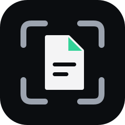

<p align="center"></p>
<h1 align="center">EnclavePDF</h1>
<p align="center">Compress PDFs in your browser. The file never leaves the tab.</p>

<p align="center">
  <a href="https://enclave-pdf.vercel.app">Live demo</a> ·
  
  
  
</p>

Most online PDF compressors upload your file to a server. That's a poor trade for a tax return or a scanned ID. EnclavePDF does all the work locally. There's no backend, no account and no analytics. Load the page, switch off Wi-Fi, and it still compresses.

## Using it

1. Drop a PDF on the page, or click to browse. The UI takes files up to 50 MB.
2. Pick a preset (see the table below).
3. When it finishes, you see how much was saved, the original and compressed sizes, and a one-line note about what happened to the text. **Download document** saves the result. **Try different settings** lets you re-run the same file with another preset, and **New file** starts over.

The result card also shows which preset and DPI produced the number, so two runs on the same file are easy to compare.

## What it does to your file

There are two ways a PDF gets smaller here, and they cost different things.

**Image mode.** Every page is rendered at the DPI you pick, saved as a JPEG, and the PDF is rebuilt from those images. This is where the big savings come from, especially on scans and image-heavy files. The catch: text is no longer selectable or searchable, and links, form fields and bookmarks are gone.

**Lossless mode.** Metadata is stripped and objects are repacked into object streams. Text stays text. The savings are small, though. A 696 KB course-syllabus PDF came out at 695.8 KB.

The worker tries image mode first. If the result isn't smaller than the input, it tries lossless. If neither wins, you get your original file back and the UI says so. It does **not** check whether a page is text or a scan, so a text-heavy PDF can still get flattened if the images happen to come out smaller. Fixing that is the first item under [what's next](#whats-next).

| Preset | DPI | JPEG quality | When to use it |
|---|---|---|---|
| Low | 150 | 80% | You care about how it looks |
| Balanced | 110 | 60% | Default |
| Strong | 72 | 40% | Upload limits, like portals that cap at 200 KB |

## How it's put together

```
 main thread                        worker (pdfCompressor.worker.ts)
 ───────────                        ────────────────────────────────
 File → ArrayBuffer ──transfer──►   image mode: pdf.js → OffscreenCanvas → JPEG → pdf-lib
                                         │ not smaller?
                                         ▼
                                    lossless mode: pdf-lib (metadata, object streams)
                                         │ not smaller?
 Blob → object URL ◄──transfer───   original bytes
        │
        ▼
     download                       no network calls anywhere on this path
```

All parsing, rendering, encoding and writing happens in the worker, so the page stays responsive on long documents. The main thread reads the file, hands over the buffer, updates the progress bar once per page and builds the download link at the end. I haven't published benchmarks yet. If you want to check, record a run in the DevTools Performance panel and look for long tasks.

Memory handling, in short:

- The input buffer is transferred to the worker, not copied. The worker keeps one extra copy of the file, because pdf.js can detach the buffer it reads.
- Only one page bitmap exists at a time. It's zeroed out before the next page starts.
- Each page is capped at 16 megapixels. A huge page gets rendered at lower resolution instead of crashing the tab. For scale, an A4 page at 110 DPI is about 1.2 MP (roughly 4.7 MB of pixels). The cap is 64 MB.
- The worker is terminated after every job, and download URLs are revoked when they're replaced or the component unmounts.
- Rough peak: about twice the file size, plus pdf.js overhead, plus one page bitmap, plus the output so far.

## When things go wrong

- **Password-protected PDF:** you're asked for the password. It's only used in the tab.
- **Not a PDF, or corrupt:** you get a plain error.
- **Out of memory:** the app suggests the Strong preset or a smaller file.
- **Image engine fails in your browser:** it falls back to lossless mode and tells you it did.

Output is always JPEG. PDF has no WebP filter.

## Checking the privacy claim

The header has a small "outbound requests" indicator. Treat it as a convenience, not as proof. It can't see everything a browser can do, so check it yourself:

1. Open DevTools → Network, tick "Preserve log", and compress a file. After the initial page load there should be no requests.
2. Load the page, go offline, and compress. It should still work.
3. If you self-host, add a CSP header that blocks outbound connections:

   ```
   Content-Security-Policy: default-src 'self'; connect-src 'none'; worker-src 'self' blob:; img-src 'self' blob: data:; style-src 'self' 'unsafe-inline'
   ```

   Don't use it on the Vite dev server, it breaks hot reload.

## Stack

- **React 18 + TypeScript.** The messages between the page and the worker are one shared union type, so a mismatch is a compile error.
- **Vite 5.** Handles module workers. `worker.format: 'es'` is required here, because the pdf.js worker is an ES module.
- **pdfjs-dist 4.10.38.** Pinned on purpose. 5.x changed how workers and canvases are handled. The pdf.js parser runs inside our own worker instead of spawning a nested one, and rendering uses an `OffscreenCanvas`-backed canvas factory, since the default one needs `document`.
- **pdf-lib 1.17.1.** Writes the output PDF: embeds the JPEGs, clears metadata, saves object streams.
- **Tailwind 4.** Styling, build time only.

Needs module workers and `OffscreenCanvas` with `convertToBlob`: Chrome/Edge 80+, Firefox 114+, Safari 16.4+.

## Run it

You need Node 18 or newer.

```bash
git clone https://github.com/abhinavkdeval08-design/EnclavePDF.git
cd EnclavePDF
npm install
npm run dev       # http://localhost:5173
npm run build     # type-check, then bundle into dist/
npm run preview   # serve the production build locally
```

`dist/` is plain static files. Any static host works.

```
src/
├── pdfCompressor.worker.ts   # both compression modes
├── usePdfCompressor.ts       # worker lifecycle, state, URL cleanup
├── types.ts                  # presets and worker message types
├── App.tsx                   # UI
├── main.tsx
└── index.css
```

## What's next

- Decide per page whether it's text or a scan, instead of per file, so text PDFs stop getting flattened.
- Recompress the images inside a PDF and leave the text alone, rather than rasterizing whole pages.
- A target size ("under 200 KB") that searches for the quality and DPI to hit it.
- Better lossless mode: re-deflate streams, dedupe and subset fonts. None of that exists yet.
- mozjpeg compiled to Wasm for smaller JPEGs than the browser's encoder gives.
- Files over ~100 MB. pdf-lib keeps the whole document in memory, so this needs a different approach.
- Tests. There aren't any yet.

## License

MIT © 2026 Abhinav Deval
